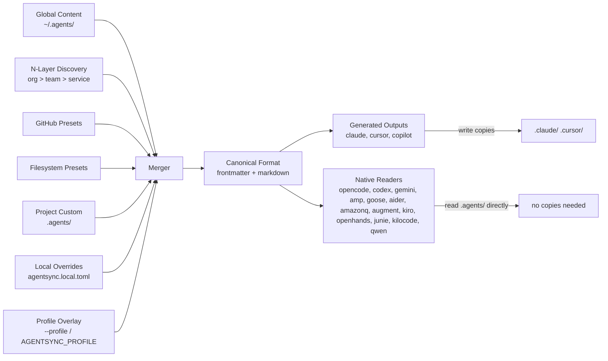
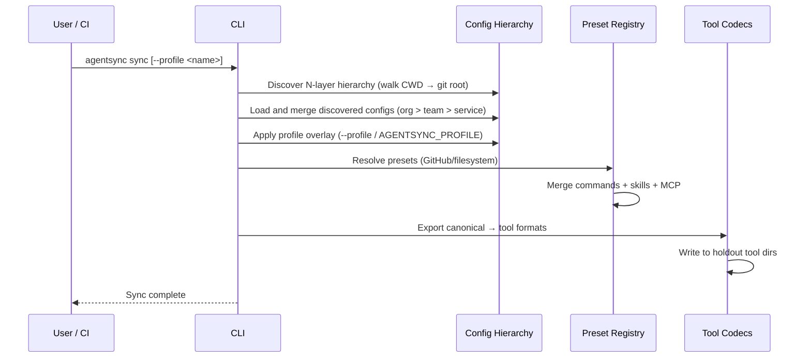

# Architecture

## System Overview

AgentSync is a CLI-first tool designed to run in CI/CD pipelines and local development alike. It syncs AI coding agent configuration (skills, commands, MCP servers) across 19 tools from a single source of truth. Non-interactive by default, deterministic, and fast (<1s for typical projects).

## CI/CD Integration

AgentSync is built for automation:

- **Non-interactive**: All commands run without prompts by default — safe for CI
- **Dry-run mode**: `agentsync sync --dry-run` previews changes without writing files
- **Profile selection via env vars**: `AGENTSYNC_PROFILE=ci agentsync sync` — no flags needed in pipeline config
- **Monorepo partial syncs**: `filterChangedSubtrees()` detects which subtrees have changes, syncing only affected areas
- **Deterministic output**: Same config always produces same tool files — safe to diff and validate

```yaml
# Example: GitHub Actions
- run: npx agentsync sync --dry-run
  env:
    AGENTSYNC_PROFILE: ci
```

### Monorepo CI Flow

In monorepos, AgentSync walks from CWD up to the git root, collecting every `.agents/agentsync.toml` it finds. CI pipelines can use subtree detection to sync only what changed:

```
my-monorepo/
├── .agents/agentsync.toml          # Root config (org-wide)
├── frontend/.agents/agentsync.toml # Frontend overrides
└── backend/.agents/agentsync.toml  # Backend overrides
```

Running from `frontend/` merges both configs -- frontend overrides root for tools, MCP servers merge per-key.

## Sync Pipeline



### Sync Sequence



## Tool Support Tiers

- **Validated CLI tools**: Maintainer-validated beta targets.
- **Optional adapters**: Supported by provider/unit tests and explicit user config, but not part of the default validated beta target set.
- **Native readers**: Tools such as OpenCode, Codex, Gemini, Amp, and Goose read `.agents/` directly. Tools that need native files get generated outputs in their directories.

## Key Entry Points

- CLI entry: `src/cli.ts`
- Sync engine: `src/sync/`
- Config loaders: `src/config/`
- Config hierarchy: `src/core/config/hierarchy.ts`
- N-layer config discovery: `src/core/config/discovery.ts`
- Config merge logic: `src/core/config/merge.ts`
- Role-based profiles: `src/core/config/profiles.ts`
- Monorepo subtree discovery: `src/core/monorepo.ts`
- Tool definitions: `src/tools/`
- MCP config: `src/core/mcp/config.ts`
- Global content: `~/.agents/` (skills, commands, agents)
- Config subcommands: `src/commands/config/`
- Doctor command: `src/commands/doctor.ts`
- Clean command: `src/commands/clean.ts`

## Key Decisions

- Copy/symlink sync with per-tool mode selection
- Canonical format with separated frontmatter for type-safe pipeline operations
- N-layer monorepo config hierarchy: walks CWD up to git root, merging all discovered configs
- Role-based profiles overlaid via `--profile` flag or `AGENTSYNC_PROFILE` env var
- MCP defined = enabled model: servers in `[mcp.*]` are active by definition
- Native readers vs holdout tools: tools that read `.agents/` directly need no file copies

## External Dependencies

- GitHub API — preset fetching via git clone (`src/core/registry/github-source.ts`)
